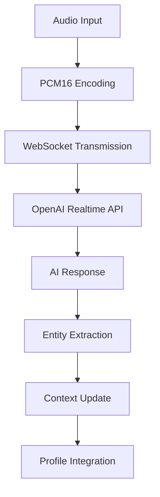

# AI Pipeline Guide

## Overview

CareerOS implements sophisticated AI processing pipelines that transform raw career data into structured, enriched profiles. This guide documents the multi-stage AI architecture, processing flows, and integration patterns that power the platform's intelligence.

## 🧠 AI Architecture Overview

### Multi-Model AI Strategy

**Core AI Models:**
- **GPT-4o**: Primary model for complex reasoning and analysis
- **GPT-4o-mini**: Fast processing for simple extraction tasks
- **o3**: Advanced reasoning for complex career analysis
- **Whisper**: Audio transcription for voice interviews
- **Embeddings**: Semantic similarity and entity matching

**Model Selection Logic:**
```typescript
const modelStrategy = {
  simple_extraction: 'gpt-4o-mini',    // Fast, cost-effective
  complex_analysis: 'gpt-4o',          // Deep reasoning required
  advanced_reasoning: 'o3',            // Multi-step problems
  voice_transcription: 'whisper-1',    // Audio processing
  embeddings: 'text-embedding-3-small' // Semantic vectors
}
```

## 🔄 Core AI Pipelines

### 1. Resume Processing Pipeline

**Architecture**: Multi-stage serverless pipeline with progress tracking

**Pipeline Stages:**

#### Stage 1: Document Parsing


**Implementation Pattern:**
```typescript
// PDF extraction with OpenAI Assistant API
async function extractPDFTextWithOpenAI(fileBuffer: ArrayBuffer): Promise<string> {
  const formData = new FormData();
  formData.append('file', new Blob([fileBuffer]), 'resume.pdf');
  formData.append('purpose', 'assistants');

  // Upload to OpenAI Files API
  const uploadResponse = await fetch('https://api.openai.com/v1/files', {
    method: 'POST',
    headers: { 'Authorization': `Bearer ${openAIKey}` },
    body: formData,
  });

  // Create assistant for text extraction
  const assistant = await createAssistant({
    name: 'Resume Text Extractor',
    instructions: 'Extract ALL text content maintaining logical structure',
    model: 'gpt-4o',
    tools: [{ type: 'file_search' }]
  });

  return extractedText;
}
```

#### Stage 2: Entity Extraction
**Purpose**: Transform unstructured text into structured career entities

**AI Prompt Strategy:**
```typescript
const entityExtractionPrompt = `
Extract structured career information from this resume text:

{resumeText}

Return a JSON object with the following structure:
{
  "personal_info": {...},
  "work_experience": [...],
  "education": [...],
  "skills": [...],
  "projects": [...],
  "certifications": [...]
}

Requirements:
- Maintain chronological order
- Extract specific dates, companies, titles
- Identify technical and soft skills
- Capture project details and achievements
- Include confidence scores for each extraction
`;
```

**Processing Logic:**
```typescript
async function extractStructuredData(resumeText: string) {
  const response = await callOpenAI({
    model: 'gpt-4o',
    messages: [
      { role: 'system', content: 'Career data extraction specialist' },
      { role: 'user', content: entityExtractionPrompt }
    ],
    temperature: 0.1, // Low temperature for consistency
    response_format: { type: 'json_object' }
  });

  return JSON.parse(response.choices[0].message.content);
}
```

#### Stage 3: Entity Normalization
**Purpose**: Standardize entities across users for consistency

**Normalization Process:**
1. **Embedding Generation**: Create vector representations
2. **Similarity Matching**: Find existing similar entities
3. **Fuzzy Matching**: Handle name variations
4. **Administrative Review**: Flag uncertain matches

**Implementation:**
```typescript
async function normalizeEntity(entity: ParsedEntity): Promise<NormalizedEntity> {
  // Generate embedding for semantic matching
  const embedding = await generateEmbedding(entity.canonical_name);
  
  // Find similar existing entities
  const similarEntities = await findSimilarEntities(embedding, entity.entity_type);
  
  if (similarEntities.length > 0 && similarEntities[0].similarity > 0.85) {
    // High confidence match
    return linkToExistingEntity(entity, similarEntities[0]);
  } else if (similarEntities.length > 0 && similarEntities[0].similarity > 0.7) {
    // Moderate confidence - flag for admin review
    return createPendingEntity(entity, similarEntities);
  } else {
    // New entity
    return createNormalizedEntity(entity, embedding);
  }
}
```

#### Stage 4: Career Enrichment
**Purpose**: Generate insights, archetypes, and narratives

**Multi-Pass Enrichment:**
```typescript
const enrichmentPasses = [
  {
    id: 'role_analysis',
    model: 'gpt-4o',
    purpose: 'Determine role archetype and career level',
    prompt: createRoleAnalysisPrompt
  },
  {
    id: 'skill_assessment', 
    model: 'gpt-4o-mini',
    purpose: 'Assess technical and soft skills',
    prompt: createSkillAssessmentPrompt
  },
  {
    id: 'narrative_generation',
    model: 'o3',
    purpose: 'Generate career narratives and summaries',
    prompt: createNarrativePrompt
  }
];
```

### 2. Real-time Interview Pipeline

**Architecture**: WebSocket-based conversational AI with context management

**Pipeline Flow:**


**Technical Implementation:**

#### Audio Processing Chain:
```typescript
// Audio recording and encoding
export class AudioRecorder {
  private audioContext: AudioContext;
  private processor: ScriptProcessorNode;

  async start() {
    this.stream = await navigator.mediaDevices.getUserMedia({
      audio: {
        sampleRate: 24000,  // Required by OpenAI
        channelCount: 1,
        echoCancellation: true,
        noiseSuppression: true,
        autoGainControl: true
      }
    });
    
    this.processor.onaudioprocess = (e) => {
      const inputData = e.inputBuffer.getChannelData(0);
      const encodedAudio = this.encodeAudioForAPI(new Float32Array(inputData));
      this.sendAudioChunk(encodedAudio);
    };
  }

  private encodeAudioForAPI(float32Array: Float32Array): string {
    // Convert to 16-bit PCM for OpenAI
    const int16Array = new Int16Array(float32Array.length);
    for (let i = 0; i < float32Array.length; i++) {
      const s = Math.max(-1, Math.min(1, float32Array[i]));
      int16Array[i] = s < 0 ? s * 0x8000 : s * 0x7FFF;
    }
    return btoa(String.fromCharCode(...new Uint8Array(int16Array.buffer)));
  }
}
```

#### Context Management:
```typescript
interface InterviewContext {
  user_id: string;
  session_id: string;
  current_phase: 'warmup' | 'experience' | 'skills' | 'goals' | 'wrap-up';
  extracted_entities: Record<string, any>;
  conversation_history: Message[];
  phase_progress: Record<string, number>;
}

async function updateInterviewContext(
  context: InterviewContext, 
  aiResponse: string, 
  userInput: string
) {
  // Extract entities from conversation
  const entities = await extractEntitiesFromConversation(aiResponse + userInput);
  
  // Update context with new information
  context.extracted_entities = mergeEntities(context.extracted_entities, entities);
  
  // Determine next phase based on completeness
  context.current_phase = determineNextPhase(context);
  
  // Store updated context
  await saveInterviewContext(context);
}
```

### 3. Resume Generation Pipeline

**Architecture**: Multi-pass AI generation with job description analysis

**Generation Process:**

#### Pass 1: Job Analysis
```typescript
async function analyzeJobDescription(jobDescription: string) {
  const analysisPrompt = `
    Analyze this job description and extract:
    1. Required skills and technologies
    2. Experience level and requirements
    3. Company culture indicators
    4. Key responsibilities
    5. Preferred qualifications
    
    Job Description: ${jobDescription}
    
    Return structured analysis for resume tailoring.
  `;

  return await callOpenAI({
    model: 'gpt-4o',
    messages: [{ role: 'user', content: analysisPrompt }],
    response_format: { type: 'json_object' }
  });
}
```

#### Pass 2: Profile Matching
```typescript
async function matchProfileToJob(userProfile: UserProfile, jobAnalysis: JobAnalysis) {
  // Score relevance of each profile element
  const experienceRelevance = await scoreExperienceRelevance(
    userProfile.workExperience, 
    jobAnalysis.requirements
  );
  
  const skillsAlignment = await scoreSkillsAlignment(
    userProfile.skills,
    jobAnalysis.requiredSkills
  );
  
  // Generate tailoring recommendations
  return {
    relevantExperience: experienceRelevance.filter(e => e.score > 0.7),
    alignedSkills: skillsAlignment.filter(s => s.score > 0.6),
    missingSkills: identifyGaps(userProfile.skills, jobAnalysis.requiredSkills),
    suggestions: generateTailoringStrategies(experienceRelevance, skillsAlignment)
  };
}
```

#### Pass 3: Resume Generation
```typescript
async function generateTailoredResume(
  userProfile: UserProfile,
  jobAnalysis: JobAnalysis,
  matchingResults: MatchingResults,
  personalizations: ResumePersonalization
) {
  const generationPrompt = createResumePrompt({
    profile: userProfile,
    jobRequirements: jobAnalysis,
    matching: matchingResults,
    personalizations
  });

  // Use O3 for complex reasoning about content structure
  const response = await callOpenAI({
    model: 'o3',
    messages: [
      { role: 'system', content: 'Expert resume writer and career strategist' },
      { role: 'user', content: generationPrompt }
    ],
    temperature: 0.3 // Some creativity while maintaining professionalism
  });

  return parseGeneratedResume(response.choices[0].message.content);
}
```

## 🔧 AI Integration Patterns

### 1. Edge Function Architecture

**Serverless AI Processing:**
```typescript
// Edge function pattern for AI operations
export const corsHeaders = {
  'Access-Control-Allow-Origin': '*',
  'Access-Control-Allow-Headers': 'authorization, x-client-info, apikey, content-type',
};

serve(async (req) => {
  if (req.method === 'OPTIONS') {
    return new Response(null, { headers: corsHeaders });
  }

  try {
    // Authentication
    const { user } = await authenticateRequest(req);
    
    // Input validation
    const requestData = await validateInput(req);
    
    // AI processing
    const result = await processWithAI(requestData, user);
    
    // Store results
    await storeResults(result, user.id);
    
    return new Response(JSON.stringify(result), {
      headers: { ...corsHeaders, 'Content-Type': 'application/json' }
    });
  } catch (error) {
    return handleError(error);
  }
});
```

### 2. Streaming Response Pattern

**Real-time AI Output:**
```typescript
async function streamAIResponse(prompt: string, onChunk: (chunk: string) => void) {
  const response = await fetch('https://api.openai.com/v1/chat/completions', {
    method: 'POST',
    headers: {
      'Authorization': `Bearer ${apiKey}`,
      'Content-Type': 'application/json',
    },
    body: JSON.stringify({
      model: 'gpt-4o',
      messages: [{ role: 'user', content: prompt }],
      stream: true
    }),
  });

  const reader = response.body?.getReader();
  if (!reader) throw new Error('No reader available');

  while (true) {
    const { done, value } = await reader.read();
    if (done) break;

    const chunk = new TextDecoder().decode(value);
    const lines = chunk.split('\n').filter(line => line.trim());
    
    for (const line of lines) {
      if (line.startsWith('data: ')) {
        const data = line.slice(6);
        if (data !== '[DONE]') {
          try {
            const parsed = JSON.parse(data);
            const content = parsed.choices[0]?.delta?.content;
            if (content) onChunk(content);
          } catch (e) {
            console.warn('Failed to parse chunk:', data);
          }
        }
      }
    }
  }
}
```

### 3. Error Recovery Patterns

**Robust AI Processing:**
```typescript
async function robustAICall(
  prompt: string, 
  options: AICallOptions,
  maxRetries: number = 3
): Promise<AIResponse> {
  let lastError: Error;
  
  for (let attempt = 1; attempt <= maxRetries; attempt++) {
    try {
      const response = await callOpenAI(prompt, options);
      
      // Validate response quality
      if (validateAIResponse(response)) {
        return response;
      } else {
        throw new Error('AI response failed validation');
      }
    } catch (error) {
      lastError = error as Error;
      
      // Exponential backoff
      if (attempt < maxRetries) {
        const delay = Math.pow(2, attempt) * 1000;
        await new Promise(resolve => setTimeout(resolve, delay));
        
        // Adjust parameters for retry
        options = adjustForRetry(options, attempt);
      }
    }
  }
  
  // Fallback strategy
  return await fallbackAIResponse(prompt, lastError);
}
```

## 📊 AI Performance Optimization

### 1. Prompt Engineering Best Practices

**Structured Prompts:**
```typescript
interface PromptTemplate {
  system: string;
  context: string;
  task: string;
  format: string;
  examples?: string;
  constraints: string;
}

function createOptimizedPrompt(template: PromptTemplate, data: any): string {
  return `
${template.system}

CONTEXT:
${template.context}

TASK:
${template.task}

FORMAT:
${template.format}

${template.examples ? `EXAMPLES:\n${template.examples}\n` : ''}

CONSTRAINTS:
${template.constraints}

DATA:
${JSON.stringify(data, null, 2)}
  `.trim();
}
```

**Dynamic Prompt Selection:**
```typescript
const promptLibrary = {
  simple_extraction: {
    model: 'gpt-4o-mini',
    temperature: 0.1,
    maxTokens: 1000
  },
  complex_analysis: {
    model: 'gpt-4o',
    temperature: 0.3,
    maxTokens: 2000
  },
  creative_writing: {
    model: 'o3',
    temperature: 0.7,
    maxTokens: 3000
  }
};

function selectOptimalPrompt(taskType: string, complexity: number) {
  if (complexity < 0.3) return promptLibrary.simple_extraction;
  if (complexity < 0.7) return promptLibrary.complex_analysis;
  return promptLibrary.creative_writing;
}
```

### 2. Caching and Rate Limiting

**Intelligent Caching:**
```typescript
interface AICache {
  key: string;
  response: any;
  timestamp: number;
  usage: number;
}

class AIResponseCache {
  private cache = new Map<string, AICache>();
  private readonly TTL = 24 * 60 * 60 * 1000; // 24 hours

  async getCachedResponse(prompt: string, model: string): Promise<any | null> {
    const key = this.generateCacheKey(prompt, model);
    const cached = this.cache.get(key);
    
    if (cached && (Date.now() - cached.timestamp) < this.TTL) {
      cached.usage++;
      return cached.response;
    }
    
    return null;
  }

  setCachedResponse(prompt: string, model: string, response: any) {
    const key = this.generateCacheKey(prompt, model);
    this.cache.set(key, {
      key,
      response,
      timestamp: Date.now(),
      usage: 1
    });
  }

  private generateCacheKey(prompt: string, model: string): string {
    return `${model}:${hashString(prompt)}`;
  }
}
```

### 3. Quality Assurance

**Response Validation:**
```typescript
interface ValidationRule {
  name: string;
  validator: (response: any) => boolean;
  severity: 'error' | 'warning';
  message: string;
}

const responseValidationRules: ValidationRule[] = [
  {
    name: 'required_fields',
    validator: (response) => response && typeof response === 'object',
    severity: 'error',
    message: 'Response must be a valid object'
  },
  {
    name: 'confidence_score',
    validator: (response) => 
      response.confidence_score >= 0 && response.confidence_score <= 1,
    severity: 'warning',
    message: 'Confidence score should be between 0 and 1'
  },
  {
    name: 'required_arrays',
    validator: (response) => Array.isArray(response.insights),
    severity: 'error',
    message: 'Insights must be an array'
  }
];

function validateAIResponse(response: any): ValidationResult {
  const errors: string[] = [];
  const warnings: string[] = [];

  for (const rule of responseValidationRules) {
    try {
      if (!rule.validator(response)) {
        if (rule.severity === 'error') {
          errors.push(`${rule.name}: ${rule.message}`);
        } else {
          warnings.push(`${rule.name}: ${rule.message}`);
        }
      }
    } catch (error) {
      errors.push(`${rule.name}: Validation failed - ${error.message}`);
    }
  }

  return {
    isValid: errors.length === 0,
    errors,
    warnings
  };
}
```

## 🔍 Monitoring and Analytics

### 1. AI Performance Metrics

**Tracking AI Operations:**
```typescript
interface AIMetrics {
  operation: string;
  model: string;
  prompt_tokens: number;
  completion_tokens: number;
  processing_time: number;
  success_rate: number;
  error_rate: number;
  cost_estimate: number;
}

class AIMetricsCollector {
  async recordOperation(
    operation: string,
    model: string,
    startTime: number,
    usage: TokenUsage,
    success: boolean
  ) {
    const metrics: AIMetrics = {
      operation,
      model,
      prompt_tokens: usage.prompt_tokens,
      completion_tokens: usage.completion_tokens,
      processing_time: Date.now() - startTime,
      success_rate: success ? 1 : 0,
      error_rate: success ? 0 : 1,
      cost_estimate: this.calculateCost(model, usage)
    };

    await this.storeMetrics(metrics);
  }

  private calculateCost(model: string, usage: TokenUsage): number {
    const pricing = {
      'gpt-4o': { input: 5.00, output: 15.00 }, // per 1M tokens
      'gpt-4o-mini': { input: 0.15, output: 0.60 },
      'o3': { input: 15.00, output: 60.00 }
    };

    const rates = pricing[model] || pricing['gpt-4o-mini'];
    return (
      (usage.prompt_tokens * rates.input / 1000000) +
      (usage.completion_tokens * rates.output / 1000000)
    );
  }
}
```

### 2. Quality Monitoring

**Content Quality Scoring:**
```typescript
async function assessContentQuality(generatedContent: string): Promise<QualityScore> {
  const metrics = {
    readability: calculateReadabilityScore(generatedContent),
    completeness: assessCompleteness(generatedContent),
    relevance: await assessRelevance(generatedContent),
    professionalism: assessProfessionalism(generatedContent),
    accuracy: await verifyFactualAccuracy(generatedContent)
  };

  const overallScore = Object.values(metrics).reduce((a, b) => a + b, 0) / Object.keys(metrics).length;

  return {
    overall: overallScore,
    breakdown: metrics,
    recommendations: generateQualityRecommendations(metrics)
  };
}
```

## 🚀 Future AI Enhancements

### 1. Advanced Reasoning

**Multi-Step Career Analysis:**
- Career progression modeling
- Market demand prediction
- Skills gap analysis with recommendations
- Industry transition planning

### 2. Personalization Engine

**Adaptive AI Responses:**
- User preference learning
- Communication style adaptation
- Domain-specific expertise
- Cultural and regional customization

### 3. Real-time Collaboration

**Multi-User AI Sessions:**
- Collaborative resume building
- Team interview processing
- Shared AI insights
- Real-time feedback integration

---

**Document Status**: AI Pipeline Guide v1.0
**Last Updated**: January 2025
**Dependencies**: TECHNICAL_FOUNDATION.md

This guide provides comprehensive documentation of CareerOS's AI architecture and processing pipelines, essential for understanding the platform's intelligent capabilities and maintaining its AI-driven features.