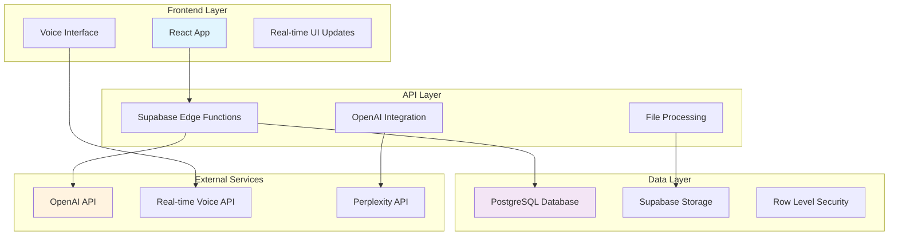

# CareerOS Architecture

## System Overview

CareerOS is a modern web application built with a serverless architecture, combining React frontend with Supabase backend services and AI integration through OpenAI APIs.

## Architecture Diagram



## Core Components

### Frontend Architecture

**Technology Stack:**
- React 18 with TypeScript
- Vite for build tooling
- Tailwind CSS + shadcn/ui
- React Query for state management
- React Router for navigation

**Key Design Patterns:**
- Component composition over inheritance
- Custom hooks for business logic
- Context providers for global state
- Real-time updates with subscriptions

### Backend Architecture

**Supabase Services:**
- **PostgreSQL Database**: Structured data storage with JSONB for flexibility
- **Edge Functions**: Serverless API endpoints for business logic
- **Authentication**: JWT-based auth with Row Level Security
- **Storage**: File upload and management
- **Real-time**: WebSocket connections for live updates

### AI Integration Layer

**OpenAI Integration:**
- GPT-4 for content generation and analysis
- Real-time Voice API for interview conversations
- Structured JSON outputs for data extraction
- Embedding generation for semantic search

**Processing Pipeline:**
1. Voice input → Real-time transcription
2. Text analysis → Entity extraction
3. Context building → Profile updates
4. Resume generation → Real-time preview

## Data Architecture

### Database Schema

The database uses a versioned entity system for tracking changes over time:

```sql
-- Core entity tables
work_experience (versioned)
education (versioned)
skill (versioned)
project (versioned)
certification (versioned)

-- Processing and enrichment
resume_versions
parsed_resume_entities
career_enrichment
entry_enrichment

-- User management
profiles
interview_sessions
interview_transcripts
```

### Entity Versioning System

Each profile entity (work experience, education, skills) uses a versioned approach:

- **logical_entity_id**: Groups related versions
- **version**: Incremental version number
- **is_current**: Current active version flag
- **source**: Origin of the data (interview, upload, manual)

This allows for:
- Complete audit trail of changes
- Rollback to previous versions
- Source attribution for data provenance
- Conflict resolution between sources

### Data Flow

1. **Input Processing**:
   - Resume uploads → PDF/Word parsing
   - Voice interviews → Real-time transcription
   - Manual edits → Direct database updates

2. **Entity Extraction**:
   - AI analysis of unstructured content
   - Named entity recognition
   - Relationship mapping
   - Confidence scoring

3. **Profile Building**:
   - Entity normalization
   - Duplicate detection
   - Timeline construction
   - Skills aggregation

## Security Architecture

### Authentication & Authorization

- **Supabase Auth**: JWT-based authentication
- **Row Level Security (RLS)**: Database-level access control
- **User Isolation**: Complete data separation between users
- **API Key Management**: Secure storage in Supabase Vault

### Data Protection

- **Encryption at Rest**: Sensitive data encrypted in database
- **Encrypted Transit**: HTTPS for all communications
- **File Security**: Secure upload and storage policies
- **Data Retention**: Configurable retention policies

### Privacy Considerations

- **Data Minimization**: Only collect necessary information
- **User Control**: Full data export and deletion capabilities
- **Audit Logging**: Track all data access and modifications
- **Compliance Ready**: GDPR and CCPA compliance framework

## Performance Architecture

### Frontend Performance

- **Code Splitting**: Lazy loading of page components
- **Caching Strategy**: React Query for intelligent caching
- **Bundle Optimization**: Tree shaking and minification
- **Image Optimization**: Responsive images with lazy loading

### Backend Performance

- **Database Optimization**: Proper indexing and query optimization
- **Edge Functions**: Serverless scaling and geographic distribution
- **CDN Integration**: Static asset delivery optimization
- **Connection Pooling**: Efficient database connection management

### Real-time Performance

- **WebSocket Optimization**: Efficient real-time updates
- **Debouncing**: Prevent excessive API calls
- **Progressive Loading**: Incremental data loading
- **Error Recovery**: Graceful handling of connection issues

## Scalability Considerations

### Horizontal Scaling

- **Serverless Functions**: Auto-scaling API endpoints
- **Database Scaling**: Supabase managed scaling
- **CDN Distribution**: Global content delivery
- **Queue Systems**: Background job processing

### Data Scaling

- **Partitioning Strategy**: User-based data partitioning
- **Archive Systems**: Historical data management
- **Caching Layers**: Multi-level caching strategy
- **Search Optimization**: Full-text search capabilities

## Integration Architecture

### External API Integration

- **OpenAI APIs**: Rate limiting and error handling
- **Webhook Systems**: Event-driven integrations
- **Third-party Services**: Modular integration approach
- **Fallback Mechanisms**: Graceful degradation strategies

### File Processing Pipeline

1. **Upload Handling**: Secure file validation and storage
2. **Format Detection**: Support for PDF, Word, plain text
3. **Content Extraction**: Text and structure parsing
4. **Entity Processing**: AI-powered data extraction
5. **Profile Integration**: Merge with existing data

## Monitoring & Observability

### Logging Strategy

- **Application Logs**: Structured logging with correlation IDs
- **Performance Metrics**: Response times and error rates
- **User Analytics**: Usage patterns and feature adoption
- **Security Events**: Authentication and access logging

### Error Handling

- **Error Boundaries**: React error boundary implementation
- **Graceful Degradation**: Fallback UI for failed components
- **Retry Logic**: Exponential backoff for API calls
- **User Feedback**: Clear error messages and recovery paths

## Development Architecture

### Code Organization

```
src/
├── components/           # Reusable UI components
│   ├── ui/              # Basic UI primitives
│   ├── shared/          # Shared business components
│   └── [feature]/       # Feature-specific components
├── pages/               # Page-level components
├── hooks/               # Custom React hooks
├── utils/               # Pure utility functions
├── types/               # TypeScript definitions
├── contexts/            # React context providers
└── integrations/        # External service integrations
```

### Build & Deployment

- **Development**: Hot module replacement with Vite
- **Testing**: Component and integration testing
- **Building**: Optimized production builds
- **Deployment**: Automated deployment with Lovable
- **Monitoring**: Real-time error tracking and performance monitoring

## Future Architecture Considerations

### Planned Enhancements

- **Microservices Migration**: Gradual service extraction
- **Advanced AI Features**: Embedding-based search and recommendations
- **Mobile Applications**: React Native or PWA implementation
- **Enterprise Features**: Multi-tenant architecture support

### Technical Debt Management

- **Regular Refactoring**: Scheduled code improvement cycles
- **Dependency Updates**: Regular security and feature updates
- **Performance Audits**: Quarterly performance reviews
- **Architecture Reviews**: Regular architecture decision documentation
