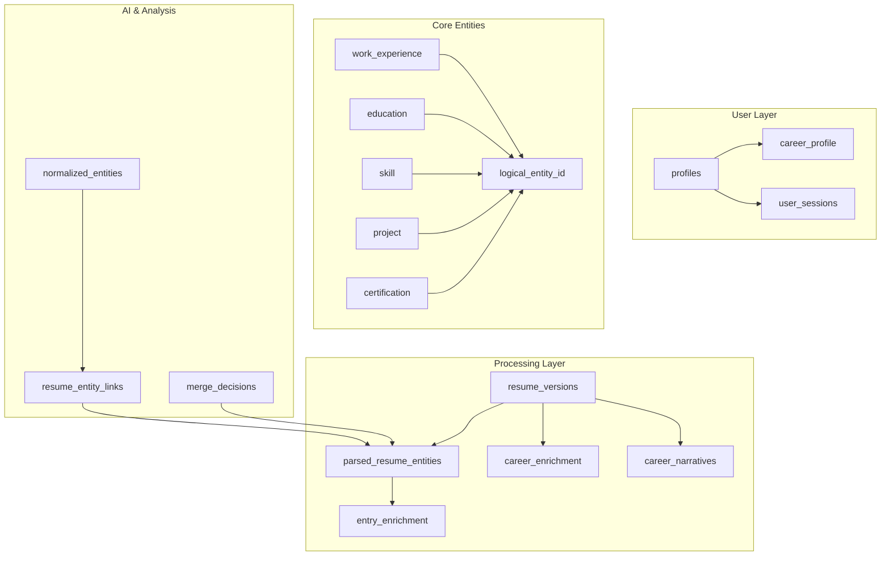

# Database Design Guide

## Overview

CareerOS employs a sophisticated PostgreSQL database architecture built on Supabase, featuring advanced patterns like versioned entities, Row Level Security (RLS), and AI-optimized data structures. This guide documents the complete database design, relationships, and architectural decisions.

## 🏗️ Database Architecture Overview

### Core Architectural Principles

1. **Versioned Entity System**: Track data evolution over time
2. **Row Level Security**: User data isolation and admin controls  
3. **AI-Optimized Storage**: JSONB fields for flexible AI-generated content
4. **Performance-First Design**: Optimized queries and indexing
5. **Audit Trail Capability**: Complete data provenance tracking

### Database Schema Layers



## 📊 Core Data Models

### 1. Versioned Entity Pattern

**Design Philosophy**: Every career entity maintains complete version history for audit trails and rollback capabilities.

**Base Pattern:**
```sql
-- Generic versioned entity structure
CREATE TABLE public.{entity_type} (
  logical_entity_id UUID NOT NULL DEFAULT gen_random_uuid(),
  version INTEGER NOT NULL DEFAULT 1,
  is_active BOOLEAN NOT NULL DEFAULT true,
  source TEXT, -- 'interview', 'upload', 'manual'
  source_confidence DOUBLE PRECISION,
  user_id UUID NOT NULL,
  created_at TIMESTAMP WITH TIME ZONE NOT NULL DEFAULT now(),
  updated_at TIMESTAMP WITH TIME ZONE NOT NULL DEFAULT now(),
  
  -- Entity-specific fields
  ...
);
```

**Implementation Examples:**

#### Work Experience Entity
```sql
CREATE TABLE public.work_experience (
  logical_entity_id UUID NOT NULL DEFAULT gen_random_uuid(),
  version INTEGER NOT NULL DEFAULT 1,
  is_active BOOLEAN NOT NULL DEFAULT true,
  source TEXT,
  source_confidence DOUBLE PRECISION,
  user_id UUID NOT NULL,
  
  -- Work-specific fields
  company TEXT NOT NULL,
  title TEXT NOT NULL,
  start_date TEXT, -- Flexible date format
  end_date TEXT,
  description TEXT,
  
  created_at TIMESTAMP WITH TIME ZONE NOT NULL DEFAULT now(),
  updated_at TIMESTAMP WITH TIME ZONE NOT NULL DEFAULT now()
);
```

#### Skills Entity with Narrative Context
```sql
CREATE TABLE public.skill (
  logical_entity_id UUID NOT NULL DEFAULT gen_random_uuid(),
  version INTEGER NOT NULL DEFAULT 1,
  is_active BOOLEAN NOT NULL DEFAULT true,
  source TEXT,
  source_confidence DOUBLE PRECISION,
  user_id UUID NOT NULL,
  
  -- Skill-specific fields
  name TEXT NOT NULL,
  category TEXT,
  proficiency_level TEXT,
  years_of_experience INTEGER,
  narrative_context TEXT, -- AI-generated context
  
  created_at TIMESTAMP WITH TIME ZONE NOT NULL DEFAULT now(),
  updated_at TIMESTAMP WITH TIME ZONE NOT NULL DEFAULT now()
);
```

### 2. Resume Processing Pipeline Tables

**Resume Streams and Versions:**
```sql
-- Resume stream (collection/project)
CREATE TABLE public.resume_streams (
  id UUID NOT NULL DEFAULT gen_random_uuid() PRIMARY KEY,
  user_id UUID NOT NULL,
  name TEXT NOT NULL DEFAULT 'Default Resume',
  description TEXT,
  tags TEXT[] DEFAULT '{}',
  auto_tagged BOOLEAN DEFAULT true,
  created_at TIMESTAMP WITH TIME ZONE NOT NULL DEFAULT now(),
  updated_at TIMESTAMP WITH TIME ZONE NOT NULL DEFAULT now()
);

-- Individual resume version within a stream
CREATE TABLE public.resume_versions (
  id UUID NOT NULL DEFAULT gen_random_uuid() PRIMARY KEY,
  stream_id UUID NOT NULL REFERENCES public.resume_streams(id) ON DELETE CASCADE,
  version_number INTEGER NOT NULL DEFAULT 1,
  file_name TEXT NOT NULL,
  file_path TEXT NOT NULL,
  file_size INTEGER NOT NULL,
  file_hash TEXT NOT NULL,
  mime_type TEXT NOT NULL,
  
  -- Processing state management
  processing_status TEXT NOT NULL DEFAULT 'pending',
  processing_progress INTEGER DEFAULT 0,
  current_stage TEXT DEFAULT 'upload',
  processing_stages JSONB DEFAULT '{
    "upload": {"status": "pending", "started_at": null, "completed_at": null, "error": null},
    "parse": {"status": "pending", "started_at": null, "completed_at": null, "error": null},
    "enrich": {"status": "pending", "started_at": null, "completed_at": null, "error": null},
    "complete": {"status": "pending", "started_at": null, "completed_at": null, "error": null}
  }',
  processing_errors JSONB DEFAULT '[]',
  processing_telemetry JSONB DEFAULT '{}',
  
  -- Metadata
  upload_metadata JSONB DEFAULT '{}',
  resume_metadata JSONB DEFAULT '{}',
  
  created_at TIMESTAMP WITH TIME ZONE NOT NULL DEFAULT now(),
  updated_at TIMESTAMP WITH TIME ZONE NOT NULL DEFAULT now()
);
```

**Parsed Entity Storage:**
```sql
CREATE TABLE public.parsed_resume_entities (
  id UUID NOT NULL DEFAULT gen_random_uuid() PRIMARY KEY,
  resume_version_id UUID NOT NULL,
  
  -- Entity information
  field_name TEXT NOT NULL, -- e.g., 'work_experience.0.company'
  raw_value TEXT,
  confidence_score DOUBLE PRECISION DEFAULT 0.0,
  source_type TEXT DEFAULT 'openai_function_call',
  model_version TEXT DEFAULT 'gpt-4o-mini',
  
  created_at TIMESTAMP WITH TIME ZONE NOT NULL DEFAULT now(),
  updated_at TIMESTAMP WITH TIME ZONE NOT NULL DEFAULT now()
);
```

### 3. AI Enrichment Tables

**Career-Level Enrichment:**
```sql
CREATE TABLE public.career_enrichment (
  id UUID NOT NULL DEFAULT gen_random_uuid() PRIMARY KEY,
  user_id UUID NOT NULL,
  resume_version_id UUID,
  
  -- AI-generated career insights
  role_archetype TEXT NOT NULL, -- 'Technical Leader', 'Individual Contributor', etc.
  role_archetype_explanation TEXT,
  persona_type TEXT NOT NULL, -- 'Builder', 'Optimizer', 'Innovator'
  persona_explanation TEXT,
  
  -- Scoring metrics
  leadership_score INTEGER NOT NULL,
  leadership_explanation TEXT,
  scope_score INTEGER NOT NULL,
  scope_explanation TEXT,
  technical_depth_score INTEGER NOT NULL,
  technical_depth_explanation TEXT,
  
  -- Metadata
  model_version TEXT DEFAULT 'gpt-4o-mini',
  confidence_score DOUBLE PRECISION DEFAULT 0.0,
  enrichment_metadata JSONB DEFAULT '{}',
  
  created_at TIMESTAMP WITH TIME ZONE NOT NULL DEFAULT now(),
  updated_at TIMESTAMP WITH TIME ZONE NOT NULL DEFAULT now()
);
```

**Entry-Level Enrichment:**
```sql
CREATE TABLE public.entry_enrichment (
  id UUID NOT NULL DEFAULT gen_random_uuid() PRIMARY KEY,
  user_id UUID NOT NULL,
  resume_version_id UUID NOT NULL,
  parsed_entity_id UUID NOT NULL,
  
  -- AI-generated insights for individual entries
  parsed_structure JSONB,
  insights JSONB DEFAULT '[]',
  skills_identified JSONB DEFAULT '[]',
  recommendations JSONB DEFAULT '[]',
  
  -- Assessment fields
  experience_level TEXT,
  career_progression TEXT,
  market_relevance TEXT,
  
  -- Metadata
  model_version TEXT DEFAULT 'gpt-4o-mini',
  confidence_score DOUBLE PRECISION DEFAULT 0.0,
  enrichment_metadata JSONB DEFAULT '{}',
  
  created_at TIMESTAMP WITH TIME ZONE NOT NULL DEFAULT now(),
  updated_at TIMESTAMP WITH TIME ZONE NOT NULL DEFAULT now()
);
```

**Career Narratives:**
```sql
CREATE TABLE public.career_narratives (
  id UUID NOT NULL DEFAULT gen_random_uuid() PRIMARY KEY,
  user_id UUID NOT NULL,
  resume_version_id UUID,
  
  -- Narrative content
  narrative_type TEXT NOT NULL, -- 'career_summary', 'key_strengths', 'growth_trajectory'
  narrative_text TEXT NOT NULL,
  narrative_explanation TEXT,
  
  -- Quality metrics
  model_version TEXT DEFAULT 'gpt-4o-mini',
  confidence_score DOUBLE PRECISION DEFAULT 0.0,
  
  created_at TIMESTAMP WITH TIME ZONE NOT NULL DEFAULT now(),
  updated_at TIMESTAMP WITH TIME ZONE NOT NULL DEFAULT now()
);
```

### 4. Entity Normalization System

**Normalized Entities (Global Knowledge Base):**
```sql
CREATE TABLE public.normalized_entities (
  id UUID NOT NULL DEFAULT gen_random_uuid() PRIMARY KEY,
  entity_type TEXT NOT NULL, -- 'company', 'skill', 'technology', 'university'
  canonical_name TEXT NOT NULL,
  aliases TEXT[] DEFAULT '{}',
  
  -- AI-powered matching
  embedding_vector VECTOR(1536), -- For semantic similarity (future enhancement)
  confidence_score DOUBLE PRECISION DEFAULT 1.0,
  review_status TEXT DEFAULT 'approved', -- 'approved', 'pending', 'flagged'
  
  -- Metadata
  metadata JSONB DEFAULT '{}',
  
  created_at TIMESTAMP WITH TIME ZONE NOT NULL DEFAULT now(),
  updated_at TIMESTAMP WITH TIME ZONE NOT NULL DEFAULT now()
);

-- Link parsed entities to normalized entities
CREATE TABLE public.resume_entity_links (
  id UUID NOT NULL DEFAULT gen_random_uuid() PRIMARY KEY,
  parsed_entity_id UUID NOT NULL,
  normalized_entity_id UUID NOT NULL,
  
  -- Matching details
  match_method TEXT NOT NULL, -- 'embedding', 'fuzzy', 'llm', 'manual'
  match_score DOUBLE PRECISION NOT NULL,
  confidence_score DOUBLE PRECISION DEFAULT 1.0,
  review_required BOOLEAN DEFAULT false,
  
  created_at TIMESTAMP WITH TIME ZONE NOT NULL DEFAULT now(),
  updated_at TIMESTAMP WITH TIME ZONE NOT NULL DEFAULT now()
);
```

### 5. Interview and Conversation Management

**Interview Sessions:**
```sql
CREATE TABLE public.interview_sessions (
  id UUID NOT NULL DEFAULT gen_random_uuid() PRIMARY KEY,
  user_id UUID NOT NULL,
  session_id TEXT, -- External session identifier
  
  -- Session state
  status TEXT NOT NULL DEFAULT 'created', -- 'created', 'active', 'paused', 'completed'
  interview_type TEXT DEFAULT 'general',
  current_phase TEXT DEFAULT 'warmup',
  
  -- Progress tracking
  completion_percentage INTEGER DEFAULT 0,
  progression_score INTEGER DEFAULT 0,
  total_questions_asked INTEGER DEFAULT 0,
  
  -- Context and data
  context_data JSONB DEFAULT '{}',
  phase_data JSONB DEFAULT '{}',
  session_insights JSONB DEFAULT '{}',
  
  -- Timing
  started_at TIMESTAMP WITH TIME ZONE DEFAULT now(),
  ended_at TIMESTAMP WITH TIME ZONE,
  
  -- Recommendations
  current_question_id UUID,
  next_recommended_phase TEXT,
  
  -- Media
  audio_file_url TEXT,
  
  created_at TIMESTAMP WITH TIME ZONE NOT NULL DEFAULT now(),
  updated_at TIMESTAMP WITH TIME ZONE NOT NULL DEFAULT now()
);

-- Interview transcripts and extracted context
CREATE TABLE public.interview_contexts (
  id UUID NOT NULL DEFAULT gen_random_uuid() PRIMARY KEY,
  user_id UUID NOT NULL,
  session_id UUID NOT NULL,
  
  -- Context type and data  
  context_type TEXT NOT NULL, -- 'work_experience', 'skills', 'goals', etc.
  extracted_data JSONB NOT NULL DEFAULT '{}',
  processing_status TEXT DEFAULT 'pending',
  confidence_score DOUBLE PRECISION DEFAULT 0.0,
  
  created_at TIMESTAMP WITH TIME ZONE NOT NULL DEFAULT now(),
  updated_at TIMESTAMP WITH TIME ZONE NOT NULL DEFAULT now()
);
```

## 🔒 Security Architecture

### Row Level Security (RLS) Implementation

**Performance-Optimized RLS Pattern:**
```sql
-- Create cached user context function
CREATE OR REPLACE FUNCTION public.current_user_id()
RETURNS UUID
LANGUAGE SQL
STABLE
SECURITY DEFINER
SET search_path = ''
AS $$
  SELECT auth.uid();
$$;

-- Optimized RLS policy pattern
CREATE POLICY "optimized_user_access" ON public.{table_name}
  FOR ALL USING (public.current_user_id() = user_id);
```

**Admin Access Patterns:**
```sql
-- Admin-only access function
CREATE OR REPLACE FUNCTION public.is_admin_user_optimized(user_id UUID DEFAULT NULL)
RETURNS BOOLEAN
LANGUAGE SQL
STABLE
SECURITY DEFINER
SET search_path = ''
AS $$
  SELECT COALESCE(
    EXISTS(
      SELECT 1 FROM auth.users 
      WHERE id = COALESCE(user_id, auth.uid())
      AND (
        raw_user_meta_data->>'user_role' = 'admin' OR
        email IN ('admin@careeros.com', 'security@careeros.com')
      )
    ),
    false
  );
$$;

-- Admin-accessible tables
CREATE POLICY "admin_full_access" ON public.normalized_entities
  FOR ALL USING (public.is_admin_user_optimized());
```

**Complex Relationship RLS:**
```sql
-- Access through relationships (e.g., parsed entities via resume versions)
CREATE POLICY "user_parsed_entities_access" ON public.parsed_resume_entities
  FOR ALL USING (
    resume_version_id IN (
      SELECT rv.id FROM public.resume_versions rv
      JOIN public.resume_streams rs ON rv.stream_id = rs.id
      WHERE rs.user_id = public.current_user_id()
    )
  );
```

### Audit and Security Logging

**Security Audit Table:**
```sql
CREATE TABLE public.security_audit_log (
  id UUID NOT NULL DEFAULT gen_random_uuid() PRIMARY KEY,
  user_id UUID,
  action TEXT NOT NULL,
  resource_type TEXT,
  resource_id UUID,
  ip_address INET,
  user_agent TEXT,
  details JSONB,
  created_at TIMESTAMP WITH TIME ZONE DEFAULT now()
);

-- RLS: Only admins can read audit logs
CREATE POLICY "admin_audit_access" ON public.security_audit_log
  FOR SELECT USING (public.is_admin_user_optimized());
```

## ⚡ Performance Optimizations

### Indexing Strategy

**User-Based Partitioning Indexes:**
```sql
-- User-scoped indexes for fast lookups
CREATE INDEX idx_work_experience_user_active ON public.work_experience (user_id, is_active);
CREATE INDEX idx_education_user_active ON public.education (user_id, is_active);
CREATE INDEX idx_skill_user_active ON public.skill (user_id, is_active);

-- Processing pipeline indexes
CREATE INDEX idx_resume_versions_stream ON public.resume_versions (stream_id, version_number);
CREATE INDEX idx_parsed_entities_version ON public.parsed_resume_entities (resume_version_id);
CREATE INDEX idx_entry_enrichment_user_version ON public.entry_enrichment (user_id, resume_version_id);

-- Timeline and sorting indexes
CREATE INDEX idx_work_experience_timeline ON public.work_experience (user_id, start_date DESC, end_date DESC);
CREATE INDEX idx_education_timeline ON public.education (user_id, start_date DESC, end_date DESC);
```

**JSONB Performance Indexes:**
```sql
-- GIN indexes for JSONB field searches
CREATE INDEX idx_career_enrichment_metadata_gin ON public.career_enrichment USING GIN (enrichment_metadata);
CREATE INDEX idx_entry_enrichment_insights_gin ON public.entry_enrichment USING GIN (insights);
CREATE INDEX idx_interview_context_data_gin ON public.interview_contexts USING GIN (extracted_data);

-- Specific JSONB path indexes for common queries
CREATE INDEX idx_processing_stages_status ON public.resume_versions USING GIN ((processing_stages -> 'parse' -> 'status'));
```

### Query Optimization Patterns

**Efficient Data Fetching:**
```sql
-- Get user's complete active profile in one query
WITH user_profile AS (
  SELECT 
    'work_experience' as entity_type,
    json_agg(json_build_object(
      'id', logical_entity_id,
      'company', company,
      'title', title,
      'start_date', start_date,
      'end_date', end_date,
      'description', description
    ) ORDER BY start_date DESC) as entities
  FROM public.work_experience 
  WHERE user_id = $1 AND is_active = true
  
  UNION ALL
  
  SELECT 
    'education' as entity_type,
    json_agg(json_build_object(
      'id', logical_entity_id,
      'institution', institution,
      'degree', degree,
      'field_of_study', field_of_study,
      'start_date', start_date,
      'end_date', end_date
    ) ORDER BY start_date DESC) as entities
  FROM public.education 
  WHERE user_id = $1 AND is_active = true
  
  -- ... other entity types
)
SELECT json_object_agg(entity_type, entities) as complete_profile
FROM user_profile;
```

## 🔄 Data Migration Patterns

### Schema Evolution Strategy

**Version-Safe Migrations:**
```sql
-- Pattern: Add columns with defaults to avoid breaking changes
ALTER TABLE public.skill 
ADD COLUMN IF NOT EXISTS narrative_context TEXT;

-- Pattern: Conditional constraint addition
DO $$
BEGIN
  IF NOT EXISTS (SELECT 1 FROM pg_constraint WHERE conname = 'unique_logical_entity_version') THEN
    ALTER TABLE public.work_experience 
    ADD CONSTRAINT unique_logical_entity_version UNIQUE (logical_entity_id, version);
  END IF;
END $$;
```

**Data Backfill Patterns:**
```sql
-- Safe data updates with error handling
DO $$
DECLARE
  r RECORD;
BEGIN
  FOR r IN (SELECT id FROM public.work_experience WHERE logical_entity_id IS NULL) LOOP
    BEGIN
      UPDATE public.work_experience 
      SET logical_entity_id = gen_random_uuid() 
      WHERE id = r.id;
    EXCEPTION WHEN OTHERS THEN
      -- Log error but continue
      RAISE WARNING 'Failed to update work_experience record %: %', r.id, SQLERRM;
    END;
  END LOOP;
END $$;
```

## 📊 Monitoring and Analytics

### Database Health Monitoring

**Performance Monitoring Views:**
```sql
-- View for slow queries analysis
CREATE VIEW performance_monitoring AS
SELECT 
  schemaname,
  tablename,
  attname,
  n_distinct,
  correlation,
  most_common_vals
FROM pg_stats 
WHERE schemaname = 'public'
ORDER BY tablename, attname;

-- View for table size monitoring  
CREATE VIEW table_sizes AS
SELECT 
  schemaname,
  tablename,
  pg_size_pretty(pg_total_relation_size(schemaname||'.'||tablename)) as size,
  pg_total_relation_size(schemaname||'.'||tablename) as size_bytes
FROM pg_tables 
WHERE schemaname = 'public'
ORDER BY size_bytes DESC;
```

### Data Quality Monitoring

**Completeness Scoring:**
```sql
-- Function to calculate profile completeness
CREATE OR REPLACE FUNCTION public.calculate_profile_completeness(p_user_id UUID)
RETURNS JSONB
LANGUAGE plpgsql
SECURITY DEFINER
AS $$
DECLARE
  result JSONB := '{}';
  work_count INTEGER;
  education_count INTEGER;
  skills_count INTEGER;
  completeness_score INTEGER := 0;
BEGIN
  -- Count active entities
  SELECT COUNT(*) INTO work_count FROM public.work_experience 
  WHERE user_id = p_user_id AND is_active = true;
  
  SELECT COUNT(*) INTO education_count FROM public.education 
  WHERE user_id = p_user_id AND is_active = true;
  
  SELECT COUNT(*) INTO skills_count FROM public.skill 
  WHERE user_id = p_user_id AND is_active = true;
  
  -- Calculate score
  IF work_count > 0 THEN completeness_score := completeness_score + 40; END IF;
  IF education_count > 0 THEN completeness_score := completeness_score + 30; END IF;
  IF skills_count >= 5 THEN completeness_score := completeness_score + 30; END IF;
  
  RETURN jsonb_build_object(
    'score', completeness_score,
    'work_experience_count', work_count,
    'education_count', education_count,
    'skills_count', skills_count,
    'is_complete', completeness_score >= 70
  );
END;
$$;
```

## 🚀 Scalability Considerations

### Future Enhancements

**Planned Architectural Improvements:**

1. **Vector Embeddings**: Full implementation of semantic search
2. **Partitioning**: Time-based partitioning for large tables
3. **Read Replicas**: Separate analytics workloads
4. **Caching Layer**: Redis integration for frequent queries
5. **Archive Strategy**: Historical data management

**Scaling Patterns:**
```sql
-- Time-based partitioning example (future)
CREATE TABLE public.interview_transcripts_2025_01 
PARTITION OF public.interview_transcripts 
FOR VALUES FROM ('2025-01-01') TO ('2025-02-01');

-- Materialized views for analytics (future)
CREATE MATERIALIZED VIEW public.user_career_stats AS
SELECT 
  user_id,
  COUNT(DISTINCT logical_entity_id) as total_roles,
  AVG(CASE WHEN end_date IS NULL THEN 
    DATE_PART('year', AGE(NOW(), start_date::DATE))
    ELSE DATE_PART('year', AGE(end_date::DATE, start_date::DATE))
  END) as avg_role_duration,
  MAX(start_date) as latest_role_start
FROM public.work_experience 
WHERE is_active = true
GROUP BY user_id;
```

---

**Document Status**: Database Design Guide v1.0
**Last Updated**: January 2025
**Dependencies**: TECHNICAL_FOUNDATION.md

This comprehensive database design guide captures the sophisticated data architecture that powers CareerOS's versioned entity system, AI-optimized storage patterns, and performance-critical database operations.